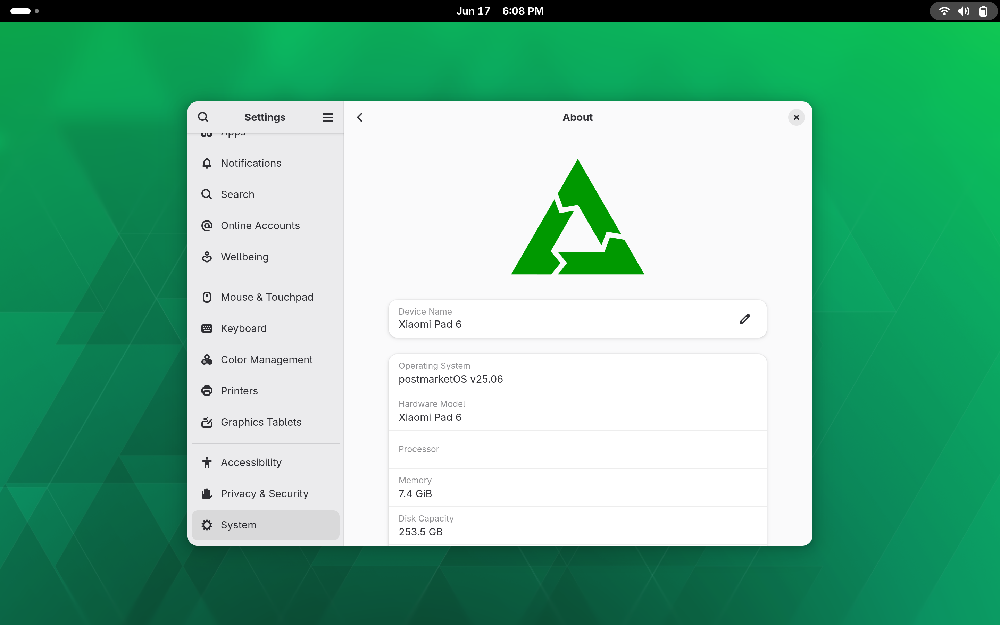

# 🧪 postmarketOS for Xiaomi Pad 6 (pipa)

  
  
<em>Custom postmarketOS builds for Xiaomi Pad 6 (codename: pipa)</em>

---

## 🌟 Features 

- **Supported Desktop Environments**  
  * KDE Plasma Desktop  
  * GNOME Shell  
  * Phosh (mobile interface)  
  * Minimal base system (no DE)

- **Automated Builds**  
  ✅ Weekly builds every Friday (UTC)  
  ✅ Kernel packages included  
  ✅ Verified device support

---

## 🔐 Login Credentials

Default System Credentials
  
- **Username:** `user`  
- **Password:** `100105` (for initial setup)

---

## 📦 Downloading Images

GitHub Actions Artifacts
  
1. Visit our [Actions tab](https://github.com/rifux/pipa-pmos-builds/actions)   
2. Look for the latest workflow run (marked with 🟢)  
3. Download the desired image:
  - `xiaomi-pipa-none_*.zip` (minimal system)
  - `xiaomi-pipa-plasma_*.zip` (KDE Plasma)
  - `xiaomi-pipa-gnome_*.zip` (GNOME Shell)
  - `xiaomi-pipa-phosh_*.zip` (Phosh interface)
  - `xiaomi-pipa-kernel_*.zip` (kernel packages)
  
*Note:* GitHub account required for downloads

---

## 🛠️ Getting Started

1. **Download** your preferred image from the Actions tab  
2. **Extract** the ZIP archive  
3. **Flash**
    fastboot erase dtbo_a
    fastboot erase dtbo_b
    fastboot flash boot_a boot-xiaomi-pipa.img
    fastboot flash boot_b boot-xiaomi-pipa.img
    fastboot flash userdata rootfs-xiaomi-pipa-gnome.img
4. **Reboot**
5. **Enjoy** postmarketOS on your Xiaomi Pad 6!

---

## 📅 Build Schedule

| Job | Frequency | Status |
|-----|----------|--------|
| Image Builds | Every Friday |   |

---

<!--
## ❓ Troubleshooting

Check out our [Wiki](https://github.com/rifux/pipa-pmos-builds/wiki)  for:
- Common issues and fixes
- Touchscreen calibration
- Battery status monitoring
- Performance optimization tips

--- -->

## 🤝 Contribution Guidelines

We welcome contributions! Please see our [Contribution Guide](CONTRIBUTING.md) for:
- Reporting issues
- Submitting feature requests
- Building custom configurations
- Improving documentation

---

> 🚀 *postmarketOS: A long-lasting, touch-optimized Linux distribution for mobile devices*

[postmarketOS Website](https://postmarketos.org/)  | [Documentation](https://wiki.postmarketos.org/) 
